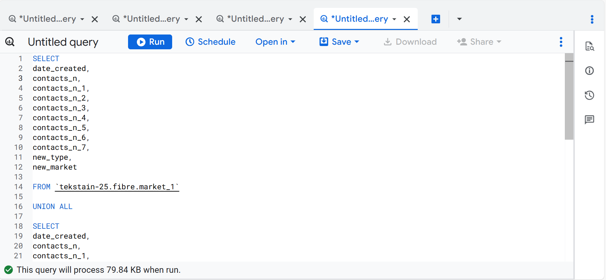
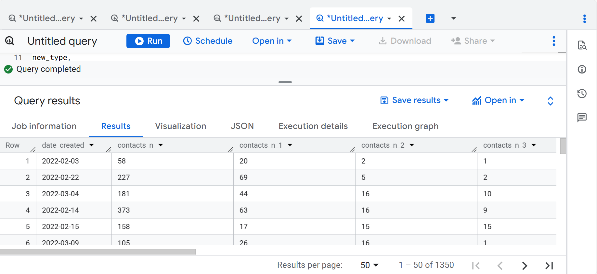
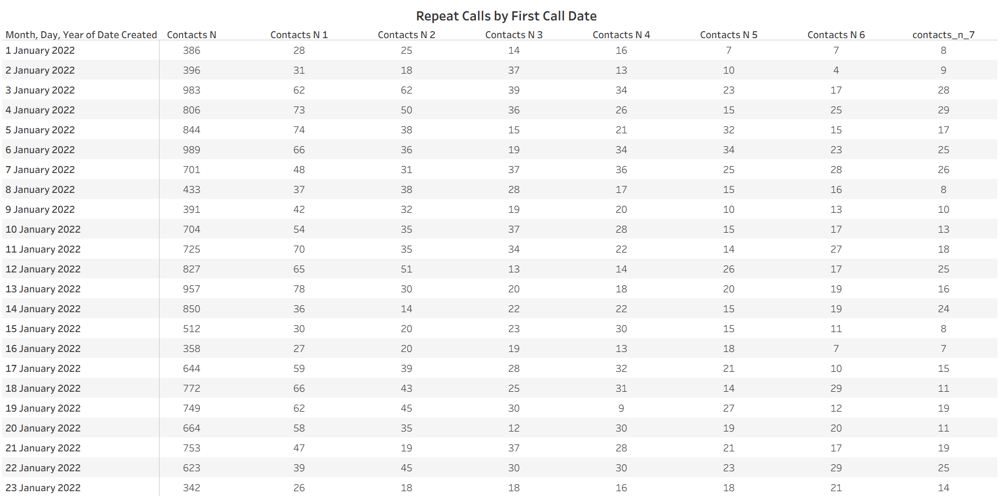
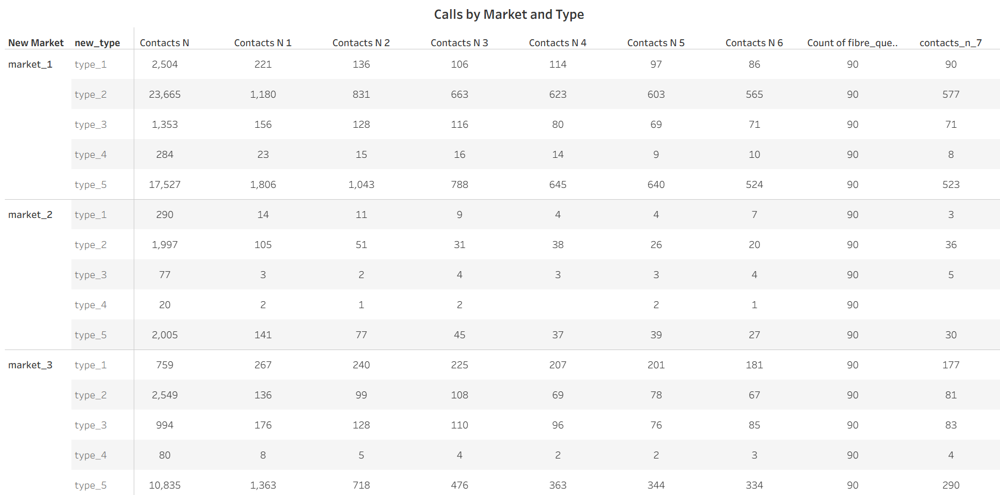

## Fiber Call Center Analytics 
This project highlights Business Intelligence solution to support Google Fiber Customer Service Team with a dashboard designed to gain insights into repeat callers.

**Business Problem**

The team’s ultimate goal is to communicate with the customers to reduce the call volume and increase customer satisfaction and improve operational optimization. 

**Requirment Documents**

After a collaborative project meeting, outlined are three key requirement documents that shaped the scope and direction of the solution.
 
|Stakeholder Requirement Document|
|----------------------------------|
|**BI Professional:** Francis Partron Addo
**Client/Sponsor:** Emma Santiago, Hiring Manager
**Business problem:** 
The team’s ultimate goal is to communicate with the customers to reduce the call volume and increase customer satisfaction and improve operational optimization. The dashboard you create should demonstrate an understanding of this goal and provide your stakeholders with insights about repeat caller volumes in different markets and the types of problems they represent. Primary question: How often are customers repeatedly contacting the customer service team?
**Stakeholders:** 
•	Emma Santiago, Hiring Manager
•	Keith Portone, Project Manager
•	Minna Rah, Lead BI Analyst
•	Ian Ortega, BI Analyst
•	Sylvie Essa, BI Analyst
**Stakeholder usage details:** 
To understand how effectively the team is able to answer customer questions and resolve problems, the stakeholders would like to explore how often customers are calling repeatedly in different markets with different problems. 
**Primary requirements:** 
•	A chart or table measuring repeat calls by their first contact date
•	A chart or table exploring repeat calls by market and problem type
•	Charts showcasing repeat calls by week, month, and quarter
•	Provide insights into the types of customer issues that seem to generate more repeat calls
•	Explore repeat caller trends in the three different market cities
•	Design charts so that stakeholders can |


  |Project requirement document|
  |-----------------------------|
  |**BI Analyst:** Francis Partron Addo
**Client/Sponsor:** Emma Santiage, Hiring Manager
**Purpose:** 
As part of the interview process, the Fiber customer service team has asked for a dashboard using fictional call center data based on the data they use regularly on the job to gain insights about repeat callers. The team’s ultimate goal is to communicate with the customers to reduce the call volume and increase customer satisfaction and improve operational optimization. The dashboard you create should demonstrate an understanding of this goal and provide your stakeholders with insights about repeat caller volumes in different markets and the types of problems they represent.
**Key dependencies:** 
The datasets are fictionalized versions of the actual data this team works with. Because of this, the data is already anonymized and approved. However, you will need to make sure that stakeholders have data access to all datasets so they can explore the steps you’ve taken. The primary contacts are Emma Santiago and Keith Portone.
**Stakeholder requirements:** 
Prioritized the requirements as: **R** - required, **D** - desired, or **N** - nice to have.)
In order to continuously improve customer satisfaction, the dashboard must help Google Fiber decision-makers understand how often customers are having to repeatedly call and what problem types or other factors might be influencing those calls. 
•	A chart or table measuring repeat calls by their first contact date **R**
•	A chart or table exploring repeat calls by market and problem type **R**
•	Charts showcasing repeat calls by week, month, and quarter **D**
•	Provide insights into the types of customer issues that seem to generate more repeat calls **D**
•	Explore repeat caller trends in the three different market cities **R**
•	Design charts so that stakeholders can view trends by week, month, quarter, and year  **R**
**Success criteria:** 
•	**Specific:** BI insights must clearly identify the specific characteristics of a repeat calls, including how often customers are repeating calls. 
•	**Measurable:** Calls should be evaluated using measurable metrics, including frequency and volume. For example, do customers call with a specific problem more often than others? Which market city experiences the most call? How many customers are calling more than once? 
•	**Action-oriented:** These outcomes must quantify the number of repeat callers under different circumstances to provide the Google Fiber team with insights into customer satisfaction. 
•	**Relevant:** All metrics must support the primary question: How often are customers repeatedly contacting the customer service team? 
•	**Time-bound:** Analyze data that spans at least one year to understand how repeat callers change over time. Exploring data that spans multiple months will capture peaks and valleys in usage. 
**User journeys:** 
The team’s ultimate goal is to communicate with the customers to reduce the call volume and increase customer satisfaction and improve operational optimization. The dashboard you create should demonstrate an understanding of this goal and provide your stakeholders with insights about repeat caller volumes in different markets and the types of problems they represent.
**Assumptions:** 
In order to anonymize and fictionalize the data, the datasets the **columns market_1, market_2, and market_3** to indicate three different city service areas the data represents. 
**The data also lists five problem types:**
•	Type_1 is account management
•	Type_2 is technician troubleshooting
•	Type_3 is scheduling
•	Type_4 is construction
•	Type_5 is internet and wifi
Additionally, the dataset also records repeat calls over seven-day periods. The initial contact date is listed as contacts_n. The other call columns are then contacts_n_number of days since first call. For example, contacts_n_6 indicates six days since first contact. 
**Compliance and privacy:**
The datasets are fictionalized versions of the actual data this team works with. Because of this, the data is already anonymized and approved. However, you will need to make sure that stakeholders have data access to all datasets so they can explore the steps you’ve taken. 
**Accessibility:** 
The dashboards should offer text alternatives including large print and text-to-speech.
**Roll-out plan**
The stakeholders have requested a completed BI tool in six weeks.|


**Strategy Document:**

**Name:** Francis Partron Addo

**Role:** BI Analyst

**Date:** 20th Aug.2025

**Proposer:** Emma Santiage, Hiring Manager

**Status:** Draft > Under review > Implemented | Not implemented

**Dataset:** market_1, market_2, market_3

**User Profiles:**

•	Emma Santiage, Hiring Manager

•	Keith Portone, Project Manager

•	Minna Rah, Lead BI Analyst

•	Ian Ortega, BI Analyst

•	Sylvie Essa, BI Analyst

  **Dashboard Functionality**
  |         **Dashboard Feature**                 |      **Request**                 |
  |--------------------------|-----------------------|
  |     Reference dashboard                     |Build a new dashboard to explore the number of repeat callers and their problem types in three different market cities.|
  |Access|Access will be provided as read-only to the user profiles listed in this document.|
  |Scope|Fields include: date, market, problem_type, contact_n and contact_n_#|
  |Date filters and granularity|Data filters can be applied for the following:Week, Month, Quarter                                                            **Granularity:** Any chart with detailed metrics should have the ability to click on that metric to view specific information.|

 **Metrics & Chats**

 **Chart 1**
|    Chart Feature        |    Request                |
|-----------|---------------------|
|     Chart Title      |    Day 0 Calls by day of week  |
|Chart type| bar |
|Dimension(s)|Date, Contact |
|matrics| Date|

 **Chart 2**
|    Chart Feature        |    Request                |
|-----------|---------------------|
|     Chart Title      |    Market and Type for first repeat calls  |
|Chart type| bar |
|Dimension(s)|Contact, New market, New_type |
|matrics| New_type|

 **Chart 3**
|    Chart Feature        |    Request                |
|-----------|---------------------|
|     Chart Title      |    Repeat Calls by Month  |
|Chart type| bar |
|Dimension(s)|Date, Value |
|matrics| Contact|

 **Chart 4**
|    Chart Feature        |    Request                |
|-----------|---------------------|
|     Chart Title      |    Repeat Calls by first call date  |
|Chart type| Table |
|Dimension(s)|Date, contact |
|matrics| Contact|

 **Chart 5**
|    Chart Feature        |    Request                |
|-----------|---------------------|
|     Chart Title      |  Calls by market and type  |
|Chart type| Table |
|Dimension(s)|contact,market and type |
|matrics| Contact|


**Data source**

The project started with three cleaned datasets provided by the data engineer in .csv file. Although they came from different sources, the columns were standardized, making them ready for analysis.

1. market_1 - market_1.csv
2. Market_2 - market_2.csv
3. Market_3 - market_3.csv

**Data Processing**

The datasets were loaded into BigQuery for analysis. As they shared the same column structure, I needed to write a query to union them into a single target table for further analysis and visualization.

```sql
SELECT 
date_created,
contacts_n,
contacts_n_1,
contacts_n_2,
contacts_n_3,
contacts_n_4,
contacts_n_5,
contacts_n_6,
contacts_n_7,
new_type,
new_market
FROM `tekstain-25.fibre.market_1`

UNION ALL

SELECT 
date_created,
contacts_n,
contacts_n_1,
contacts_n_2,
contacts_n_3,
contacts_n_4,
contacts_n_5,
contacts_n_6,
contacts_n_7,
new_type,
new_market
FROM `tekstain-25.fibre.market_2` 

UNION ALL

SELECT 
date_created,
contacts_n,
contacts_n_1,
contacts_n_2,
contacts_n_3,
contacts_n_4,
contacts_n_5,
contacts_n_6,
contacts_n_7,
new_type,
new_market
FROM `tekstain-25.fibre.market_3` 

```


**Query** 



**Query result** 

target table



Results saved and downloded as .csv file, ready for further analysis and visualization in Tableau.


**Visualization**

- **Tool:** Tableua


**Key observations:**

- **Weekdays dominate call activity**, Monday through Friday account for the majority of calls each month.
- **Monday** consistently has the highest or near-highest share (18.4–18.6%) in January and February, suggesting a post-weekend surge in activity.
- In **March**, the pattern shifts slightly, **Wednesday and Thursday** see the highest call proportions (~18%), while Monday drops somewhat (15.4%).
- **Weekends (Saturday and Sunday)** show the lowest call volumes throughout, particularly Sunday (7–9%).
- The **distribution is relatively balanced across weekdays**, with small monthly variations but clear reduction on weekends.
**Overall insight:** Call activity is heavily concentrated during weekdays, especially early to mid-week, with a consistent decline on weekends — indicating business-hour or workweek-driven calling behavior.


**Key observations:**

- **Market_1** has the highest overall call volume, dominated by **type_5 (1,806 contacts)** and **type_2 (1,180 contacts)** — indicating these two call types are major drivers in this market.
- **Market_2** has very low activity across all types, with **type_2** (105) and **type_5** (141) being the main contributors.
- **Market_3** shows moderate activity, again led by **type_5 (1,363 contacts)**, followed by **type_1 (267)** and **type_3 (176)**.
- **Type_4** is consistently minimal across all markets.
**Overall insight:**
Type_5 consistently generates the highest number of first repeat calls across all markets, especially in Markets 1 and 3. Market_2 has the lowest engagement overall, suggesting a need for further investigation into market conditions or operational factors there.


**Key observations:**

- **Overall repeat calls increased month over month**, rising from **21,134 in January** to **19,352 in February**, and peaking at **24,453 in March**, indicating growing repeat activity over time.
- Across all months, **“Contacts N”** consistently dominates, representing the largest share of total repeat calls by a wide margin.
- The remaining contact groups (**Contacts N1–N7**) show relatively stable but much smaller volumes, with slight growth from January to March.
- **March** shows the highest values across nearly all contact categories, reinforcing the upward trend in repeat calls.
**Overall insight:**
Repeat call volume is trending upward through the first quarter, with a particularly strong increase in March. The consistent dominance of “Contacts N” suggests it’s the key driver of overall repeat activity, potentially warranting deeper analysis into its causes and patterns.







**Dashboard**


- **First Dashboard**


- **Second Dashboard**


- **Third Dashboard**


  
