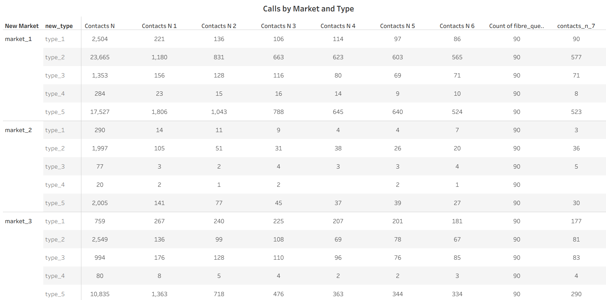
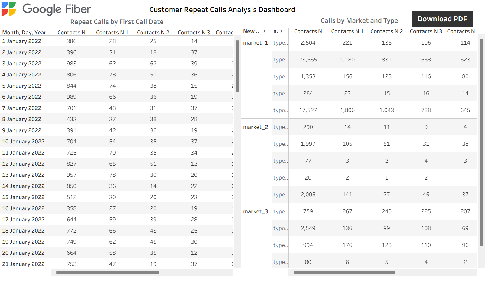
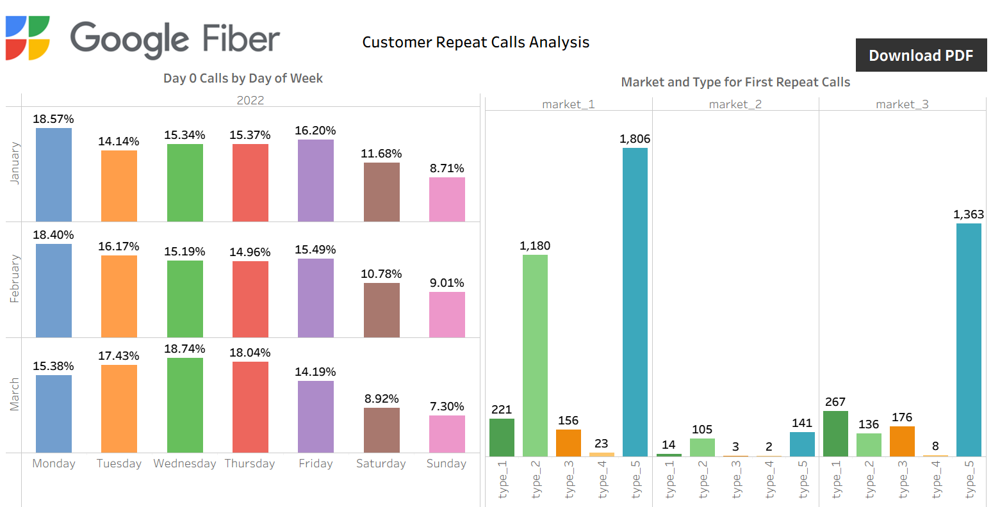

## Fiber Call Center Analytics 
This project highlights Business Intelligence solution to support Google Fiber Customer Service Team with a dashboard designed to gain insights into repeat callers.

**Business Problem**

The team’s ultimate goal is to communicate with the customers to reduce the call volume and increase customer satisfaction and improve operational optimization. 

**Requirment Documents**

After a collaborative project meeting, outlined are three key requirement documents that shaped the scope and direction of the solution.
 
|Stakeholder Requirement Document|
|----------------------------------|
|**BI Professional:** Francis Partron Addo
**Client/Sponsor:** Emma Santiago, Hiring Manager
**Business problem:** 
The team’s ultimate goal is to communicate with the customers to reduce the call volume and increase customer satisfaction and improve operational optimization. The dashboard you create should demonstrate an understanding of this goal and provide your stakeholders with insights about repeat caller volumes in different markets and the types of problems they represent. Primary question: How often are customers repeatedly contacting the customer service team?
**Stakeholders:** 
•	Emma Santiago, Hiring Manager
•	Keith Portone, Project Manager
•	Minna Rah, Lead BI Analyst
•	Ian Ortega, BI Analyst
•	Sylvie Essa, BI Analyst
**Stakeholder usage details:** 
To understand how effectively the team is able to answer customer questions and resolve problems, the stakeholders would like to explore how often customers are calling repeatedly in different markets with different problems. 
**Primary requirements:** 
•	A chart or table measuring repeat calls by their first contact date
•	A chart or table exploring repeat calls by market and problem type
•	Charts showcasing repeat calls by week, month, and quarter
•	Provide insights into the types of customer issues that seem to generate more repeat calls
•	Explore repeat caller trends in the three different market cities
•	Design charts so that stakeholders can |
- Project requirement document
- Strategy requirement document

**Data source**

The project started with three cleaned datasets provided by the data engineer in .csv file. Although they came from different sources, the columns were standardized, making them ready for analysis.

1. market_1 - market_1.csv
2. Market_2 - market_2.csv
3. Market_3 - market_3.csv

**Data Processing**

The datasets were loaded into BigQuery for analysis. As they shared the same column structure, I needed to write a query to union them into a single target table for further analysis and visualization.

```sql
SELECT 
date_created,
contacts_n,
contacts_n_1,
contacts_n_2,
contacts_n_3,
contacts_n_4,
contacts_n_5,
contacts_n_6,
contacts_n_7,
new_type,
new_market
FROM `tekstain-25.fibre.market_1`

UNION ALL

SELECT 
date_created,
contacts_n,
contacts_n_1,
contacts_n_2,
contacts_n_3,
contacts_n_4,
contacts_n_5,
contacts_n_6,
contacts_n_7,
new_type,
new_market
FROM `tekstain-25.fibre.market_2` 

UNION ALL

SELECT 
date_created,
contacts_n,
contacts_n_1,
contacts_n_2,
contacts_n_3,
contacts_n_4,
contacts_n_5,
contacts_n_6,
contacts_n_7,
new_type,
new_market
FROM `tekstain-25.fibre.market_3` 

```


**Query** 


**Query result** 

target table


Results saved and downloded as .csv file, ready for further analysis and visualization in Tableau.


**Visualization**

- **Tool:** Tableua





**Dashboard**


- First Dashboard


- Second Dashboard



- Third Dashboard


  
