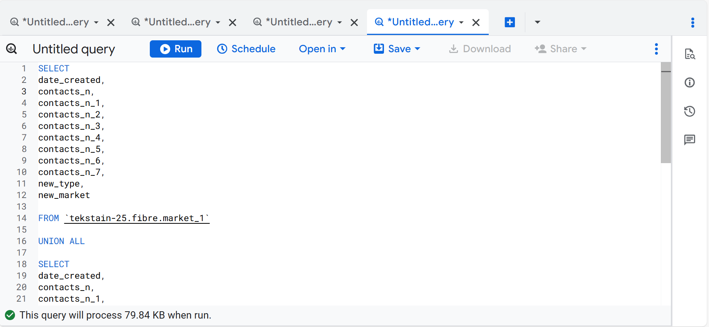
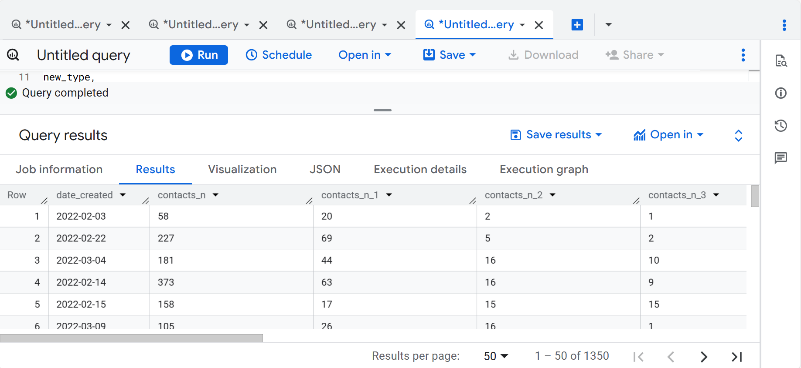
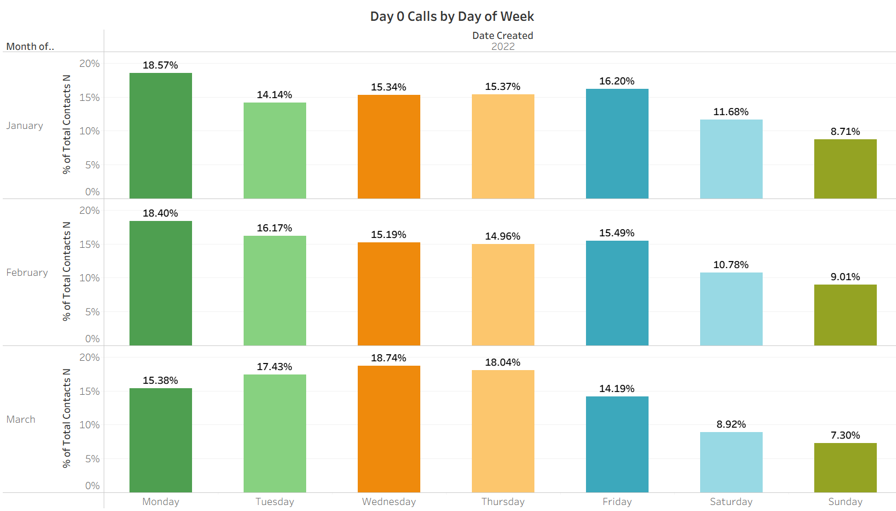
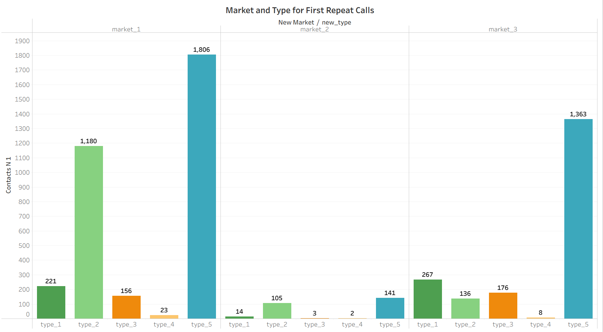
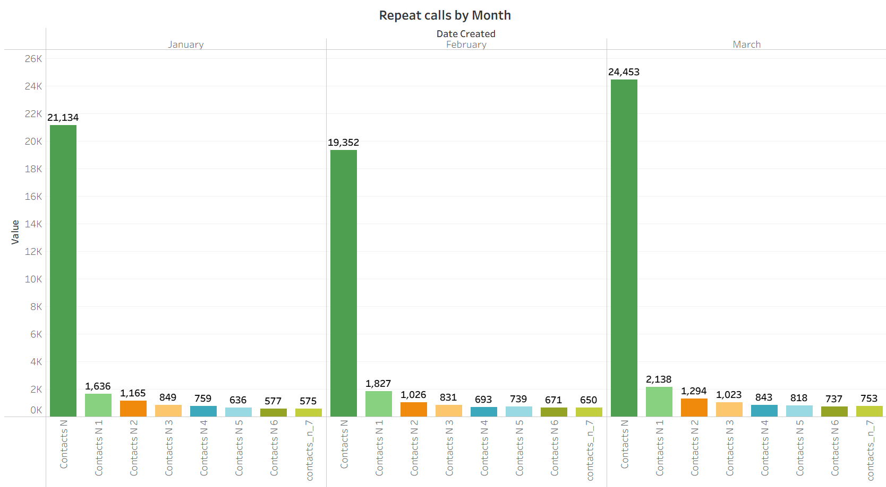
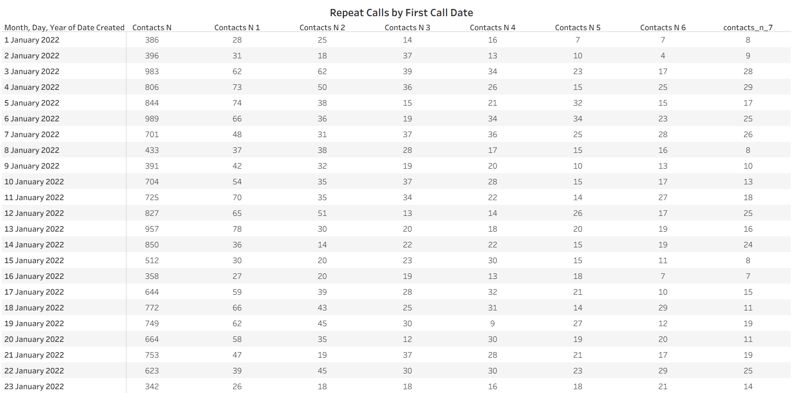

## Fiber Call Center Analytics 
This project highlights my Business Intelligence solution to support the Google Fiber Customer Service Team with a dashboard designed to gain insights into repeat callers.


**Business Problem**

The team’s ultimate goal is to communicate with the customers to reduce the call volume and increase customer satisfaction and improve operational optimization. 

**Project Requirment Documents**

After a collaborative project meeting, I outlined three key requirement documents that shaped the scope and direction of the solution.

- Stakeholder requirement document
- Project requirement document
- Strategy requirement document

**Data source**

The project started with three cleaned datasets provided by the data engineer in .csv file. Although they came from different sources, the columns were standardized, making them ready for analysis.

1. market_1 - market_1.csv
2. Market_2 - market_2.csv
3. Market_3 - market_3.csv

**Data Processing**

The datasets were loaded into BigQuery for analysis. As they shared the same column structure, I only needed to write a query to union them into a single target table for further analysis and visualization.

```sql
SELECT 
date_created,
contacts_n,
contacts_n_1,
contacts_n_2,
contacts_n_3,
contacts_n_4,
contacts_n_5,
contacts_n_6,
contacts_n_7,
new_type,
new_market
FROM `tekstain-25.fibre.market_1`

UNION ALL

SELECT 
date_created,
contacts_n,
contacts_n_1,
contacts_n_2,
contacts_n_3,
contacts_n_4,
contacts_n_5,
contacts_n_6,
contacts_n_7,
new_type,
new_market
FROM `tekstain-25.fibre.market_2` 

UNION ALL

SELECT 
date_created,
contacts_n,
contacts_n_1,
contacts_n_2,
contacts_n_3,
contacts_n_4,
contacts_n_5,
contacts_n_6,
contacts_n_7,
new_type,
new_market
FROM `tekstain-25.fibre.market_3` 

```

**Query** 


**Query result** 

target table



Results saved and downloded as .csv file, ready for further analysis and visualization in Tableau.

**Visualization**

**Tool:** Tableua










**Dashboard Mockup**

**Dashboard**
